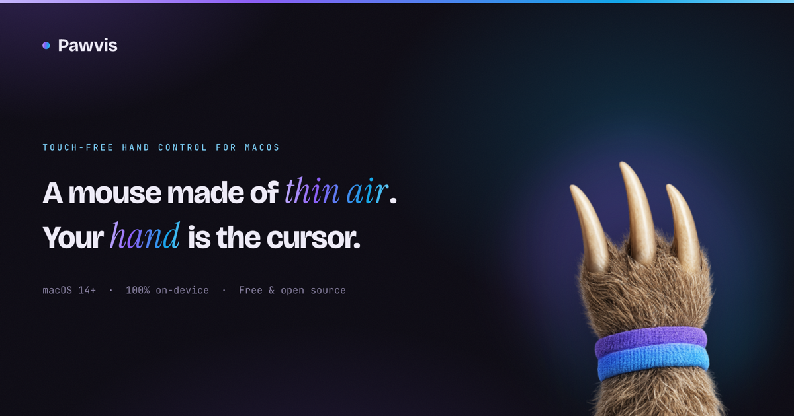

# Pawvis



**Point, pinch, and speak — hands-free control for your Mac.**

Pawvis is a macOS menu bar app that turns your webcam into a pointing device
and your voice into a keyboard. Move the cursor by moving your hand, click by
pinching, scroll with a two-finger pose, and dictate text with wake words —
all without touching a mouse or keyboard.

- **All hand tracking runs on-device** (Apple's Vision framework — no cloud,
  no model downloads).
- **Voice dictation is optional and on-device by default** (Apple's speech
  engine — SpeechAnalyzer on macOS 26+, SFSpeechRecognizer before that).
  Switch to the OpenAI Realtime engine in Settings if you prefer; only then
  does audio leave your Mac, and only while dictation is armed.
- **Fingertip overlays** show exactly what Pawvis sees: dots on your
  fingertips and a ring that tightens as your pinch approaches a click, so
  grabbing a window and dragging it feels precise.

## Gestures

Deliberately minimal — three motions, learned in seconds:

| Gesture | Action |
|---|---|
| Open hand, move | **Move** — the claw cursor follows your hand |
| Close your hand (grab) | **Left click** — twice quickly = double-click, thrice = triple |
| Keep it closed and move | **Drag** — open your hand to let go |

The claw shows state at a glance: open paw while pointing, retracted purple
paw while your hand is closed, a ring that tightens as you close, and a pulse
on every registered click. Grab sensitivity, smoothing, and camera reach are
tunable in **Settings**.

## Voice dictation

1. Arm dictation from the menu bar (Start next to Dictation). A pill
   appears: *listening*.
2. Start a sentence with a **wake word** — `type`, `text`, `enter`, `write`,
   or `dictate` (editable): *"type hello world"* types `hello world` into
   whatever app has focus.
3. Keep talking; each utterance is typed with sensible spacing. Say
   **"new line"**, **"new paragraph"**, **"press enter"**, or **"press tab"**
   for those actions.
4. Say **"stop typing"** (or any configured stop phrase) to stop typing while
   staying armed; use the gesture again to disarm completely.

The default engine is **Apple's on-device recognition** — private, free, no
setup. The **OpenAI engine** (Settings → Dictation) uses `gpt-4o-transcribe`
by default (`gpt-live-transcribe`, `gpt-4o-mini-transcribe`, and `whisper-1`
also available) and needs your API key — paste the whole key including its
`sk-` prefix. An optional low-latency mode types words as you say them and
reconciles revisions with backspaces.

## Install & run

Requirements: macOS 14+, Xcode toolchain, a webcam.

```bash
make app       # builds release + assembles build/Pawvis.app
open build/Pawvis.app
```

Other targets:

```bash
make test      # run the unit test suite (120+ tests)
make build     # debug build
make icon      # regenerate icon assets via the OpenAI Images API
build/Pawvis.app/Contents/MacOS/Pawvis --selftest   # headless smoke test
```

### Permissions

Pawvis needs, and will prompt for:

- **Camera** — hand tracking (frames never leave your Mac).
- **Accessibility** — posting mouse/keyboard events (System Settings →
  Privacy & Security → Accessibility). Tracking runs without it, but clicks
  won't land until granted.
- **Microphone** — only when you first arm dictation.

> **Important (ad-hoc signing):** every rebuild changes the app's code
> signature, and macOS then ignores the old Accessibility grant **while still
> showing it as enabled** in System Settings. The symptom is "the cursor
> halo moves but nothing clicks, in every app." Fix: remove Pawvis from
> Privacy & Security → Accessibility and re-add it after each `make app`.

### OpenAI API key (only for the OpenAI engine)

The default Apple engine needs no key. If you switch to the OpenAI engine,
add your key in **Settings → Dictation** (the whole key, `sk-` prefix
included) — it's stored in your login keychain, never in the app bundle or
settings files. For development, Pawvis also picks up `OPENAI_API_KEY` from
the environment or a `.env` file in the repo root (git-ignored).

## Architecture

```
Sources/
  PawvisCore/          pure logic, fully unit-tested, no AppKit/AVFoundation
    Geometry/          Vec2 · One Euro filter · interaction-box mapper
    Hands/             21-landmark model · pinch/splay/fist/shaka features
    Gestures/          GestureEngine: frames → clicks/drags/scrolls/toggles
    Dictation/         wake-word parser · OpenAI Realtime protocol codec
    Config/            settings tree (field-tolerant decoding)
  Pawvis/              the menu bar app
    Camera/            AVCaptureSession · Vision hand pose → core Hands
    Control/           CGEvent mouse + keyboard synthesis
    Overlay/           per-screen click-through windows, fingertip dots,
                       pinch iris, dictation HUD
    Dictation/         mic capture (24 kHz PCM16) · realtime websocket ·
                       dictation controller
    App/ UI/           MenuBarExtra, settings tabs, gesture guide, self-test
```

Design notes:

- The gesture engine is **deterministic and clock-free** — timing comes from
  frame timestamps, so click chaining, hold-to-drag, hysteresis, debounce,
  and tracking-loss releases are all covered by unit tests.
- Clicking is a **hand close**, detected on sporecaster's openness scalar
  (mean fingertip-to-palm distance normalized by hand scale) with a
  hysteresis band and a two-frame debounce. The cursor anchors on the palm,
  which barely moves while the fingers curl — so clicks are inherently
  position-stable with no correction machinery.
- Landmark smoothing is One Euro per joint with sporecaster's slot tracking
  and 300 ms stale reset; mouse events post through a paced serial queue
  (≥6 ms apart — unpaced pairs get dropped by macOS and wedge apps).
- If tracking drops mid-drag, held buttons release automatically after a
  grace window — nothing gets stuck down. Quitting the app does the same.

## Privacy

- Camera frames are processed in-memory by Vision and discarded; the overlay
  windows are excluded from screenshots and screen recordings.
- With the default Apple engine, dictation audio never leaves your Mac.
  With the OpenAI engine, audio streams to OpenAI **only** between arming and
  disarming dictation; the pill and menu bar icon always show when that's the
  case.
- The API key lives in the keychain. `.env` is git-ignored.

## Development

```bash
swift test                     # 120+ core tests
swift build                    # debug binary
scripts/generate_icon.sh       # regenerate icon/banner (needs OPENAI_API_KEY)
```

Icon and banner artwork were generated with `gpt-image-1.5` via
`scripts/generate_icon.sh`.
