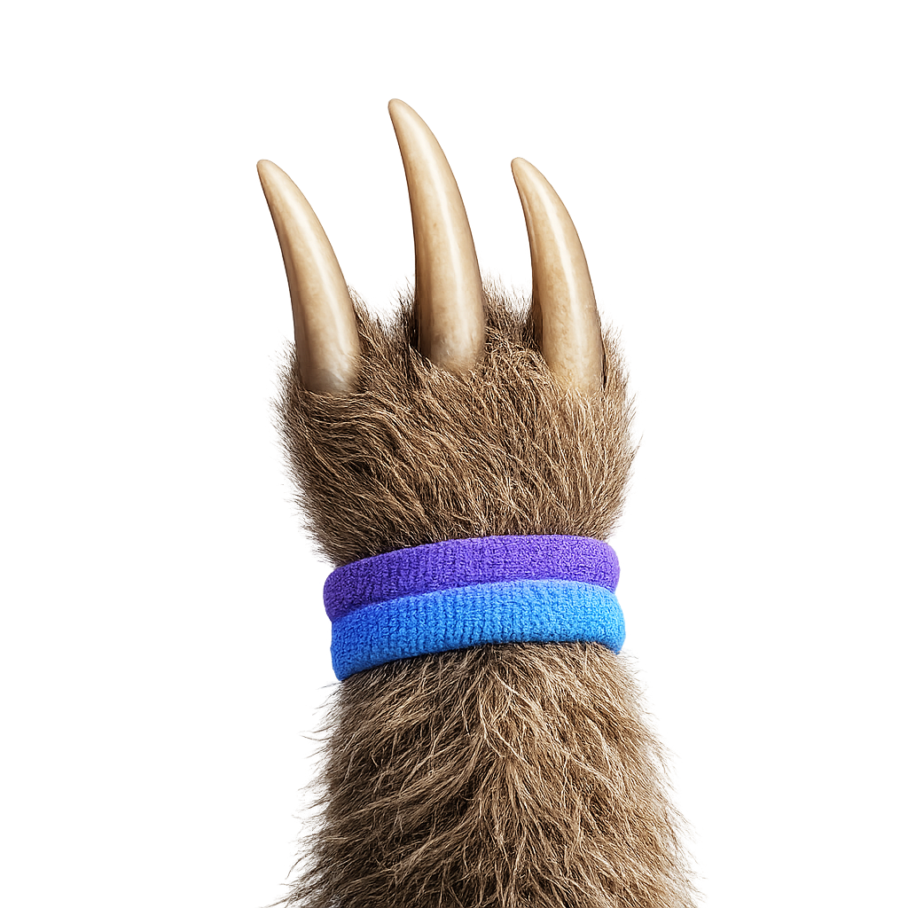

<h1 align="center">Pawvis</h1>

<p align="center">
  
</p>

<p align="center"><em>macOS visual gesture &amp; voice control</em></p>

---

Pawvis turns your webcam into a pointing device and your voice into full
control of the machine. Move your hand to move the cursor, dip a finger to
click, and talk to your Mac by name — *"Pawvis, go to github.com"*, *"Pawvis,
type hello"*, *"Pawvis, open Safari"* — without touching a mouse or keyboard.
The aim is an accessibility-grade voice control that's more intuitive and
capable than the built-in one.

Hand tracking runs entirely on-device with Apple's Vision framework; speech
recognition is Apple's on-device engine; and free-form visual commands are
resolved by on-device Apple Intelligence. Nothing you do leaves your Mac.

<p align="center">
  <a href="https://github.com/alexandriax/pawvis/releases/latest/download/Pawvis.zip"><strong>⬇&nbsp; Download Pawvis for macOS</strong></a>
  <br>
  <a href="https://github.com/alexandriax/pawvis/releases/latest"></a>
  <br>
  <sub>Signed and notarized · macOS 14+ · unzip and drag to Applications</sub>
</p>

## Gestures

Your hands are tracked whenever tracking is on, but the cursor only follows
once you **show an open hand** — all four fingers up, thumb free. Close it
into a fist for a moment, or take it out of view, to park the cursor again;
the claw fades while it's parked. That keeps a hand that's merely visible —
resting, typing, gesturing — from dragging the cursor around. **Settings →
Tracking** switches back to "Any detected hand" if you'd rather have no
trigger at all.

Once you have it, your hand is the mouse: the cursor rides your palm, and your
fingers are the buttons. Everything below is tunable in **Settings →
Gestures**.

- **Move** — hold your hand open, fingers up, and move it.
- **Click** — dip your **index finger**, like tapping a mouse button.
  Measured against your middle finger, so tilting your whole hand can't
  click. A quick release is always a clean click.
- **Right-click** — dip a second finger (**pinky** by default, configurable).
  Hold it to right-drag.
- **Drag / hold** — keep the finger down and move. Deliberate movement starts
  a drag immediately; otherwise a short window protects quick clicks from
  turning into accidental drags. The window length is a slider.
- **Double / triple click** — tap again quickly in the same spot.
- **Scroll** — fold your **middle and ring fingers** in, index and pinky up,
  then move your hand up and down. The cursor parks while the pose is held.
  Toggle it — or invert the direction — in Settings.
- **Reach adapts to distance.** Auto mode sizes the tracking area from how big
  your hand looks, so the whole screen stays reachable up close *and* far away
  with your fingers staying inside the camera frame. Manual mode gives you a
  fixed area and a slider.

The on-screen claw is your cursor: open while pointing, retracted and purple
while the left button is held, blue for the right button, ringed in light blue
while scrolling, faded while control is parked, with a ring that tightens as
your click forms and a pulse confirming every click. Small dots mark each
detected fingertip.

The menu bar icon opens a live status panel — hands seen, whether control is
armed, voice-control state — plus a **Gesture Guide** window that walks
through every gesture.

## Voice control

Open the menu bar icon and press **Start** next to Voice control, then
address Pawvis by its **wake word** (default `Pawvis`, configurable;
mishearings are tolerated):

| Say | Pawvis does |
|---|---|
| "Pawvis, **go to** heresalexandria dot com" | Navigates the frontmost browser there (via the address bar); opens your default browser if you're not in one. Non-URL targets become a web search. |
| "Pawvis, **type** good morning" | Types into the focused app and keeps typing what you say. A **pause** (default 2.5 s) or *"stop typing"* ends it; *"new line"* and *"press enter"* work mid-typing. |
| "Pawvis, **press** command shift T" | Presses any key or shortcut — enter, tab, escape, arrows, page up/down, F-keys, letters and digits with modifiers. |
| "Pawvis, **open** Notes" | Launches (or brings forward) an app — fuzzy name matching. |
| "Pawvis, **switch to** Chrome" | Brings a running app forward. |
| "Pawvis, **click** / right click / double click" | Clicks at the pointer. |
| "Pawvis, **scroll** down / up a page" | Scrolls at the pointer. |
| "Pawvis, **click sign in**" (anything free-form) | On-device Apple Intelligence reads the screen **around your pointer** (accessibility elements + OCR) and works out the action — widening to the whole screen only if the target isn't nearby. |
| "Pawvis, **stop listening**" | Turns voice control off. |

Speech recognition is **Apple's on-device engine** — private, free, no API
key, no cloud (SpeechAnalyzer on macOS 26+, SFSpeechRecognizer before that).
Visual commands need macOS 26 with Apple Intelligence enabled; everything
else works without it.

## Install

[**Download Pawvis.zip**](https://github.com/alexandriax/pawvis/releases/latest/download/Pawvis.zip)
(always the latest release), unzip, and drag **Pawvis.app** to your
Applications folder.

Pawvis starts with you after every login, so gesture control is just there —
turn it off in **Settings → General → Launch Pawvis at login** (or in System
Settings → General → Login Items; Pawvis won't put itself back).

Pawvis checks for updates once a day and can install them itself —
**Settings → About → Check Now**.

### Permissions

On first run Pawvis asks for:

- **Camera** — hand tracking. Frames are processed in memory and discarded.
- **Accessibility** — moving the cursor and clicking. Tracking runs without
  it, but clicks won't land until it's granted (System Settings → Privacy &
  Security → Accessibility).
- **Microphone** — only when you first start voice control.
- **Screen Recording** *(optional)* — lets visual voice commands OCR what
  accessibility can't describe (canvases, images). Everything else works
  without it.

Releases are signed with a Developer ID and notarized by Apple, so they open
normally — no right-click → Open, and the Accessibility permission you grant
carries across updates.

## Build from source

Requires macOS 14+ and the Xcode toolchain.

```bash
make app            # release build → build/Pawvis.app
open build/Pawvis.app
```

```bash
swift test          # 239 unit tests
swift build         # debug build
```

Icon art is derived deterministically from `claw.png` — no API, no key:

```bash
swift scripts/process_claw.swift        # app icon, menu bar glyph, claw cursor
./scripts/generate_icon.sh --icns-only  # rebuild AppIcon.icns from that art
```

See [AGENTS.md](AGENTS.md) for architecture notes, the settings-UI rules, and
the hard-won gesture-engine constraints.

## How it works

```
Sources/
  PawvisCore/          pure logic, unit-tested, no AppKit/AVFoundation
    Geometry/          Vec2 · One Euro filter · interaction-box mapper
    Hands/             21-landmark model · pinch/dip/curl metrics
    Gestures/          GestureEngine: frames → clicks, drags, scrolls, cursor moves
    VoiceControl/      wake-word + command parser · spoken URLs & key chords
    Update/            semantic versions · update-check policy
    Config/            settings tree (field-tolerant decoding)
  Pawvis/              the menu bar app
    Camera/            AVCaptureSession · Vision hand pose
    Control/           CGEvent mouse + keyboard synthesis
    Overlay/           click-through claw cursor and indicators
    VoiceControl/      on-device speech engine · command executor ·
                       screen context (AX + OCR) · Apple Intelligence resolver
    Update/            update checking and self-update
    Support/           permissions · logging · theme
    App/ UI/           menu bar, settings, gesture guide
```

The gesture engine is deterministic and clock-free — all timing comes from
frame timestamps — so click chaining, drag timing, hysteresis, debounce and
tracking-loss recovery are covered by unit tests rather than by hand.

## Privacy

- Camera frames never leave your Mac, and the overlay is excluded from
  screenshots and screen recordings by default (there's a toggle if you want
  to record a demo).
- Voice audio never leaves your Mac — recognition is Apple's on-device
  engine, and the menu bar icon carries a dot for as long as the mic is live.
  (The on-screen pill announces it too, then fades after five seconds so it
  isn't sitting on your screen all day.)
- Visual commands are resolved by the on-device Apple Intelligence model; the
  screenshots and accessibility snapshots it reads stay in memory and are
  never written to disk or uploaded.

## License

MIT
